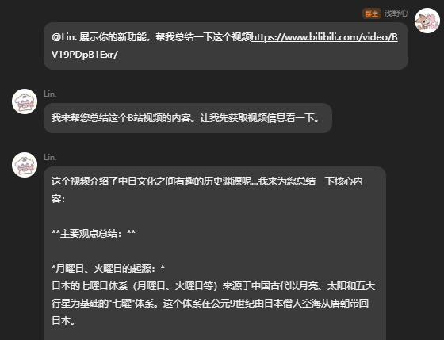

# 🎬 BiliRead - 让 AI 理解 B 站视频

> AstrBot 插件，让 AI 理解 B 站视频，并给出符合人设的自然回复



## ✨ 功能特性

- 🧠 **深度理解**：不使用机械的死板总结指令！利用 AstrBot 独家的大模型 Function Call 机制，在用户发送包含 B站网址的消息时，让 AI 主动获取字幕阅读并融合聊天上下文中自然回复。
- 🎙️ **智能音频转写（新！）**：如果视频**没有字幕**，插件将自动调用 B 站强大的必剪 ASR 引擎，将视频原声完整提取并转写成文字给大模型阅读，再无盲区！
- 📱 **扫码登录（新！）**：告别繁琐的抓包找 Cookie！在聊天框内一句 `/B站登录` 即可通过 B站 App 扫码安全登入，状态跨版本永久保留。
- ⚙️ **热切换与管理**：拥有最高管理员权限实时开关大模型总结能力与音频下载能力。

## 📦 安装

在 AstrBot 管理后台的 **插件市场** 中搜索 `BiliRead` 进行安装。如果你喜欢手动安装：

```bash
cd data/plugins
git clone https://github.com/yomihime/astrbot_plugin_biliread.git
```

### ⚠️ 前置依赖要求 (极其重要)
为了支持高级的**无字幕音频提取**功能，你需要确保 AstrBot 所在的宿主机/容器内安装了 **`ffmpeg`**。
* Windows 用户：访问官网下载 ffmpeg 并添加到系统环境变量。
* Linux 用户：运行 `apt-get install ffmpeg` 或 `apk add ffmpeg`。
*(如果你不需要无字幕转写，只看已有字幕的视频，可以无视此条。)*

## ⚙️ 配置说明

安装完成后，打开 AstrBot 后台 -> AstrBot 插件 -> 找到 `BiliRead` 以填写以下基础配置：

1. **管理员ID** (`admin_id`)：
   填入你的 QQ 号或使用的平台身份标识。设定后，只有你可以在聊天界面通过命令控制由于费流太多不想开放的功能。
2. **总结模型** (`llm_provider_id`)：
   挑选一个专门用来“阅读字幕并总结”的 AI 模型（长视频耗费 Token 多，建议使用便宜量大的小模型）。

## 🚀 使用方法

### 扫码登录大本营 (重要初始化)
因为爬取 B 站音频和字幕需要较高权限，你必须使用账号登录。
**在聊天框对机器人发送以下命令：**
- `/B站登录` ：机器人会发出一张二维码图片，请打开B站手机 App 扫码确认。登录成功后状态永久留存！
- `/B站状态`：随时查询你的登录掉没掉。
- `/B站登出`：安全清理配置记录。

### 日常聊天

本插件以 **Tool (大模型工具)** 的形式隐形运行，**无需特定前缀！**
当你或群友与 AstrBot 聊天时，只要里面包含一串 **B站视频链接** 或者 **BV号**（例如：“好想玩这个游戏啊 BV1GJ411x7h7 ”），AI 就会自动接管，在后台执行下载转写后结合原话进行回复！

### 管理员高阶指令

由于转写超长且没字幕的视频非常慢且耗流量，如果你不想大模型今天接业务，你可以对机器人私聊：
- `/B站总结` (或 `/B站总结开关`)：全局开关切换。关闭后，机器人直接拒绝访问此功能，避免群友白嫖 Token。
- `/B站转写` (或 `/视频转写`)：关闭后，遇到无字幕视频不会再傻傻去下载音频了，直接作罢。

*(注：以上开关状态会自动永久保存进配置文件，重启不丢失。)*

## ⚠️ 常见问题

1. **为什么查状态显示“未登录”？**
   登录信息可能已失效，请重新发送 `/B站登录`。
2. **风控拦截**：
   如果多名群友同时短时间内高并发疯狂发视频，B 站可能会触发风控阻断请求，请尽量正常社交频率使用。
3. **音频转写失败：显示“Precondition Failed”**
   说明你可能忘记了登录，或者系统并没有成功识别出环境中的 `ffmpeg`，请检查依赖是否正常部署。

## 📦 本地打包与发布

在仓库目录执行 `python scripts/build.py`，即可在 `dist/` 生成插件 ZIP、SHA-256 校验文件和本版本的 Release 说明。ZIP 内只有安装所需的插件文件，不包含测试、工作流或本地数据。Windows 也可使用 `py -3 scripts/build.py`。

发布新版本时，先同步修改 `metadata.yaml` 与 `main.py` 中 `@register` 的版本号，并在 `CHANGELOG.md` 增加对应版本小节。提交这些改动后创建并推送同名 tag，例如：

```bash
git tag v1.3.0
git push origin v1.3.0
```

`.github/workflows/tag-build.yml` 仅在推送版本 tag 时运行。它会检查 tag 与插件版本一致、tag 提交位于 `master` 历史中，随后构建 ZIP、校验哈希，并将文件同时保存为 Actions 产物和 GitHub Release 附件。

## 📜 开源协议

AGPL-3.0 license

本仓库 fork 自 [SodaCodeSave 原版](https://github.com/SodaCodeSave/astrbot_plugin_biliread)，并整合了 [DZeroK233 二开版](https://github.com/DZeroK233/astrbot_plugin_biliread) 的扫码登录和音频转写等功能。
